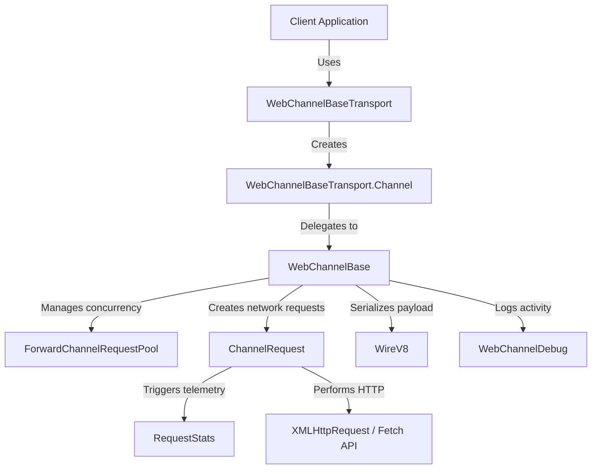

# WebChannel JS Code Map

This document provides a developer's guide and code map for the Google Closure-based WebChannel JavaScript client library (`webchannel/js`).

---

## 1. Directory Structure

Below is the directory layout of the `webchannel/js` project:

```
webchannel/js/
├── CODE_MAP.md                # This file
├── Makefile                   # Standard Makefile for build/install tasks
├── package.json               # Package metadata and build scripts
├── compile.js                 # Node.js Closure Compiler runner script
├── exports.js                 # Entry point defining external JS module exports
├── demo/                      # Demo application for verification & testing
│   ├── index.html             # HTML user interface for the demo
│   ├── demo.ts                # TypeScript client-side demo code
│   ├── server.js              # Minimal local Node.js web server
│   └── package.json           # Build & run scripts for the demo
├── dist/                      # Production bundled assets
│   ├── webchannel_blob_es2022.js    # Compiled and bundled JS library
│   └── webchannel_blob_es2022.d.ts # TypeScript definitions for the bundle
└── imported_src/              # Core library source code (from Google Closure Library)
    ├── channel.js             # Core interface defining connection callbacks
    ├── channelrequest.js      # Wraps a single HTTP request (XHR / Fetch Streams)
    ├── connectionstate.js     # Stores connectivity state (handshake / buffering)
    ├── environment.js         # Origin trial and Chrome version detection
    ├── forwardchannelrequestpool.js  # Manages concurrent outgoing requests pool
    ├── netutils.js            # Network connectivity test utilities
    ├── requeststats.js        # Event logging and connection telemetry
    ├── webchannelbase.js      # Main protocol implementation (state machine, retries)
    ├── webchannelbasetransport.js # Public wrapper bridging to standard WebChannel APIs
    ├── webchanneldebug.js     # Debug logging and payload redactor (for privacy)
    ├── wire.js                # Core wire protocol constants and structures
    ├── wirev8.js              # Version 8 protocol serializer/deserializer
    ├── testing/               # Test infrastructure helper mocks
    │   └── fakewebchannel.js  # In-memory mock WebChannel for tests
    └── tests/                 # Unit tests for the modules
        ├── channelrequest_test.js
        ├── forwardchannelrequestpool_test.js
        ├── webchannelbase_test.js
        ├── webchannelbasetransport_test.js
        └── wirev8_test.js
```

---

## 2. Core Architecture & Communication Flow

The library handles bidirectional communication by wrapping raw HTTP requests into a protocol state machine.



### Component Interaction Flow
1. **Entry Point**: The application calls `createWebChannelTransport()` from [webchannel_blob_es2022.d.ts](dist/webchannel_blob_es2022.d.ts) to get a transport factory.
2. **Channel Instantiation**: The transport creates a high-level `WebChannel` implementation using [webchannelbasetransport.js](imported_src/webchannelbasetransport.js).
3. **Core Protocol**: This high-level wrapper delegates operations to [webchannelbase.js](imported_src/webchannelbase.js), which manages retry logic, buffering checks, handshakes, and switches between hanging-GET (streaming) back-channels and long-polling fallbacks.
4. **Serialization**: Data payloads are formatted by [wirev8.js](imported_src/wirev8.js) using the V8 wire protocol.
5. **Network Requests**: Outgoing messages are managed via the [forwardchannelrequestpool.js](imported_src/forwardchannelrequestpool.js) (which enforces single concurrency on HTTP/1.x or multi-request pooling on HTTP/2/SPDY). Individual requests are sent via [channelrequest.js](imported_src/channelrequest.js).

---

## 3. Detailed Component Reference

### Core Logic & Interfaces

* **[imported_src/channel.js](imported_src/channel.js)**
  * **Module**: `goog.labs.net.webChannel.Channel`
  * **Role**: Defines the core interface for the channel implementation. It specifies abstract methods for creating XHRs, handling streaming headers, domain-limit fallbacks, checking connection states, and receiving request data/callbacks.
* **[imported_src/webchannelbase.js](imported_src/webchannelbase.js)**
  * **Module**: `goog.labs.net.webChannel.WebChannelBase`
  * **Role**: Implements the core protocol loop. It maintains the internal state machine (`INIT`, `OPENING`, `OPENED`, `CLOSED`), performs connection handshakes, schedules retry intervals based on network conditions, and handles server-defined host prefixes to bypass browser per-domain concurrent request limits.
* **[imported_src/webchannelbasetransport.js](imported_src/webchannelbasetransport.js)**
  * **Module**: `goog.labs.net.webChannel.WebChannelBaseTransport`
  * **Role**: Adapts the internal `WebChannelBase` protocol to match the public `goog.net.WebChannelTransport` and `goog.net.WebChannel` interfaces, providing standard event listeners (`OPEN`, `CLOSE`, `MESSAGE`, `ERROR`).
* **[imported_src/channelrequest.js](imported_src/channelrequest.js)**
  * **Module**: `goog.labs.net.webChannel.ChannelRequest`
  * **Role**: Encapsulates the execution of a single HTTP request (XHR or Fetch Streams). It manages browser-offline events, response chunk decoding, and timeout watchdog timers.

### Protocol & Serialization

* **[imported_src/wire.js](imported_src/wire.js)**
  * **Module**: `goog.labs.net.webChannel.Wire`
  * **Role**: Holds wire-format constants, specifically stating version support (`Wire.LATEST_CHANNEL_VERSION = 8`), and defines `Wire.QueuedMap` which holds unsent message payloads.
* **[imported_src/wirev8.js](imported_src/wirev8.js)**
  * **Module**: `goog.labs.net.webChannel.WireV8`
  * **Role**: Implements version 8 serialization. It converts message maps into URL-encoded parameters (compressing the keys using offsets relative to a base map ID) and decodes incoming JSON chunks.
* **[imported_src/forwardchannelrequestpool.js](imported_src/forwardchannelrequestpool.js)**
  * **Module**: `goog.labs.net.webChannel.ForwardChannelRequestPool`
  * **Role**: Manages concurrent outgoing client-to-server requests. If the browser uses HTTP/2, H2, or SPDY, concurrency is scaled up to 10 (default). Otherwise, it limits concurrency to exactly 1 request to prevent blocking standard HTTP/1.1 connections.

### Telemetry, Logging & Utilities

* **[imported_src/requeststats.js](imported_src/requeststats.js)**
  * **Module**: `goog.labs.net.webChannel.requestStats`
  * **Role**: Emits telemetry events related to server reachability and network statistics (latency, failures, buffering proxy statuses). Applications can subscribe to the singleton event target via `getStatEventTarget()`.
* **[imported_src/webchanneldebug.js](imported_src/webchanneldebug.js)**
  * **Module**: `goog.labs.net.webChannel.WebChannelDebug`
  * **Role**: Debug logger that wraps logging APIs. To protect user privacy, it includes a redactor (`maybeRedactPostData_` and `redactResponse_`) that scrubs non-system fields, preventing sensitive business/customer payloads from ending up in diagnostic log files.
* **[imported_src/netutils.js](imported_src/netutils.js)**
  * **Module**: `goog.labs.net.webChannel.netUtils`
  * **Role**: Provides helper diagnostics like `testNetwork`, which checks client reachability by loading a `cleardot.gif` image or pinging a server.
* **[imported_src/connectionstate.js](imported_src/connectionstate.js)**
  * **Module**: `goog.labs.net.webChannel.ConnectionState`
  * **Role**: Structure tracking buffering proxy detection results and handshake messages.
* **[imported_src/environment.js](imported_src/environment.js)**
  * **Module**: `goog.labs.net.webChannel.environment`
  * **Role**: Detects environments supporting Google's fetch upload streaming origin trials for `*.google.com` hosts.

---

## 4. Dist Bundle (Public Interface)

The built output is distributed under the `dist/` folder:
* **[dist/webchannel_blob_es2022.js](dist/webchannel_blob_es2022.js)**: Bundled JavaScript library transpiled to ES2022 standard.
* **[dist/webchannel_blob_es2022.d.ts](dist/webchannel_blob_es2022.d.ts)**: TypeScript declaration file defining key options, events, error codes, and factory functions:
  * `createWebChannelTransport()`: Factory to instantiate the WebChannel transport.
  * `getStatEventTarget()`: Telemetry event subscriber.
  * `WebChannelOptions`: Configuration interface (includes options like `sendRawJson`, `detectBufferingProxy`, `forceLongPolling`, `fastHandshake`, `useFetchStreams`).

---

## 5. Testing Infrastructure

* **[imported_src/testing/fakewebchannel.js](imported_src/testing/fakewebchannel.js)**
  * **Module**: `goog.labs.net.webChannel.testing.FakeWebChannel`
  * **Role**: A mock implementation of the public `WebChannel` interface. It stores all "sent" messages in-memory so test cases can assert on sent payloads without triggering real networks.
* **Unit Tests**:
  * Core test files are located under [imported_src/tests/](imported_src/tests/).
  * Each JavaScript test runner (e.g., [channelrequest_test.js](imported_src/tests/channelrequest_test.js)) has a corresponding minimal HTML DOM file (e.g., [channelrequest_test_dom.html](imported_src/tests/channelrequest_test_dom.html)) designed for browser-based test runners.

---

## 6. Running the Demo Application

The `demo/` folder contains a TypeScript web app demonstrating library initialization and connectivity testing.

### Demo Setup
* **[demo/index.html](demo/index.html)**: Front-end UI allowing developers to customize connectivity parameters and view logs.
* **[demo/demo.ts](demo/demo.ts)**: Interacts with the bundled WebChannel module, hooks into `OPEN`, `MESSAGE`, `ERROR`, and `CLOSE` events, and records round-trip echoes.
* **[demo/server.js](demo/server.js)**: Simple Node.js-based HTTP server to serve the demo assets locally.

### How to Run:
1. Navigate to the demo directory:
   ```bash
   cd webchannel/js/demo
   ```
2. Install dev dependencies (e.g. `esbuild` for bundling TypeScript):
   ```bash
   npm install
   ```
3. Run the development build and start the server:
   ```bash
   npm start
   ```
4. Open your browser and navigate to `http://localhost:9000/`.

---

## 7. Compiling the Library

The project is compiled using the native version of Google Closure Compiler, resolving dependencies from both the custom [imported_src/](imported_src/) sources and the standard `google-closure-library` package.

### Build Setup Files:
* **[package.json](package.json)**: Configures dependency management and compilation scripts.
* **[Makefile](Makefile)**: Provides convenience targets (`make install`, `make build`, and `make clean`).
* **[exports.js](exports.js)**: Imports Closure namespaces (`goog.net.createWebChannelTransport`, `goog.net.WebChannel`, etc.) and maps them to standard CommonJS `module.exports`.
* **[compile.js](compile.js)**: Node.js compiler runner. It recursively resolves all Closure dependencies, filters out duplicate modules from the Google Closure Library, and configures the native GraalVM compiler binary path to run without requiring Java.

### How to Compile:
To compile the library and update the bundled `dist/webchannel_blob_es2022.js` asset:
1. Make sure you are in the `webchannel/js` directory.
2. Install the compilation dependencies (Closure Compiler and Closure Library):
   ```bash
   make install
   # or: npm install
   ```
3. Compile the library:
   ```bash
   make build
   # or: npm run build
   ```
4. Clean up build artifacts (optional):
   ```bash
   make clean
   ```
