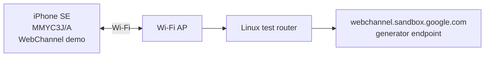
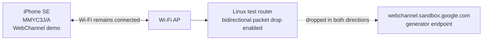

# WebChannel iOS Demo App

An iOS demo app (built with SwiftUI) to test and verify bidirectional communication with `webchannel.sandbox.google.com` using the Objective-C WebChannel client implementation (`WCWebChannelClient`).

The UI is optimized for devices ranging from compact screens like iPhone SE to iPads, providing real-time visibility into connection status, received messages, HTTP headers, and error details.

---

## 📱 Key Features

- **One-Tap Connect & Test**:
  - Connects to `https://webchannel.sandbox.google.com/staging/channel/generator`
  - Automatically sends the generator test payload (requesting 3 echoed messages) upon connection establishment
- **Real-Time Console Log**:
  - Color-coded log entries for OPEN, SEND, RECV, HEADER, ERROR, and CLOSE events
  - Auto-scroll / manual scroll toggle, clear logs, and log sharing (iOS 16+ ShareLink)
- **Custom Payload Transmission**:
  - Send custom JSON / text messages interactively during an active session
- **Connection Configuration Sheet**:
  - Configurable Base Endpoint URL
  - Configurable `HTTPSessionIDParam` (default: `gsessionid`)
  - Configurable `fastHandshake` toggle (default: OFF)

---

## 🚀 Running on iPhone SE (Physical Device)

### 1. Open the Workspace
Make sure to open **`WebChanneliOSDemo.xcworkspace`** in Xcode (not the `.xcodeproj` file).

```bash
cd objc/demo/WebChanneliOSDemo
open WebChanneliOSDemo.xcworkspace
```

### 2. Configure Code Signing (First time only)
1. Select the top-level **`WebChanneliOSDemo`** project in Xcode's left navigator
2. Navigate to the **`Signing & Capabilities`** tab
3. Ensure **`Automatically manage signing`** is checked
4. In the **`Team`** dropdown, select your Apple ID (Personal Team)
5. If the Bundle Identifier conflicts, append a unique suffix (e.g. `com.yourname.webchannel.demo`)

### 3. Setup iPhone SE
1. Connect your iPhone SE to your Mac using a Lightning or USB-C cable
2. Unlock your iPhone; when prompted with "**Trust This Computer?**", tap **Trust** and enter your passcode
3. **Enable Developer Mode** (iOS 16+):
   - On your iPhone, go to **Settings** > **Privacy & Security** > **Developer Mode**
   - Turn it **ON** and restart the device as instructed

### 4. Build and Run on Device
1. In Xcode's top toolbar, click the run destination selector and choose your connected **iPhone SE**
2. Press `Cmd + R` (or click the ▶️ Run button) to build and install the app onto your device

### 5. Trust Developer Certificate (First time on free Apple ID)
If a "Untrusted Developer" prompt appears on your iPhone when launching:
1. Open **Settings** > **General** > **VPN & Device Management** on your iPhone
2. Under "Developer App", tap your Apple ID account
3. Tap **Trust "[Your Account Name]"**

---

## 🏗️ Architecture

- **UI Layer**: SwiftUI ([`ContentView.swift`](WebChanneliOSDemo/ContentView.swift))
- **State Management & Bridge**: [`WebChannelManager.swift`](WebChanneliOSDemo/WebChannelManager.swift)
  - Implements the `WCWebChannelClientHandlerDelegate` protocol
  - Dispatches background callback events to the `@MainActor` for UI updates
- **Core Library**: Objective-C WebChannel ([`objc/imported_src`](../../imported_src))
  - Integrated via CocoaPods local path reference (`pod 'WebChannel', :path => '../../'`)

---

## Network Failure Testing

Use a physical device for these tests. A simulator cannot exercise a real Wi-Fi/mobile-data handoff.
Before each run, clear the demo log, connect successfully, wait for `Connection Opened successfully!`,
and send a custom payload. Record the timestamp of the network change, every `ERROR`/`CLOSE` entry,
and the time at which the channel becomes disconnected.

### Test Topology

Normal connectivity:



Silent packet drop enabled on the Linux test router:



| Scenario | Procedure | Expected observation |
| --- | --- | --- |
| No connectivity | Disable both Wi-Fi and mobile data while the channel is open. | The request eventually reports `Request Failed (HTTP Error / Timeout)` and the channel closes. Measure the elapsed time separately for a connection attempt and for a sent message. |
| Network handoff | Switch from Wi-Fi to mobile data, then repeat in the other direction. | The channel may have in-flight forward or back requests during the address change. Record whether it resumes, emits an error, or remains pending, and the duration of each pending request. |
| Silent packet drop | Keep the active network interface connected while using a test network that drops traffic without rejecting it. | Reachability can remain available while WebChannel waits for its per-request timeout. Run once with a sent message and once while idle to compare forward and back channel behavior. |

### Current Objective-C client timing

These values describe the bundled Objective-C WebChannel client and are the baseline for issue
testing; they are not operating-system TCP or `NSURLSession` guarantees.

| Layer or request | Current behavior |
| --- | --- |
| Initial handshake | The request ready-state timer is 45 seconds. |
| Forward channel | Each POST has a randomized 10-20 second ready-state timeout. The default permits two retries. Retry delays are 0 seconds for the first retry and 5-15 seconds for the second. |
| Back channel | A GET uses the 45-second default request timeout unless the handshake supplies a positive server keepalive value, in which case the timeout is `round(2.1 * keepalive)`. The default permits three retries. Retry delays use the same increasing delay calculation: 0 seconds, then 5-15 seconds, then 10-30 seconds. |
| `failFast` | When enabled through `WCInternalChannelParams`, forward retries are disabled. It is disabled by default. |
| Connectivity reporting | A WebChannel request timeout is reported as `Request Failed`; it does not identify whether the underlying cause was Wi-Fi loss, mobile-data loss, packet loss, or an address handoff. |

Consequently, the default implementation does not guarantee a 30-second client abort for every
offline path. An initial connection can wait up to 45 seconds, and an established forward channel
can span multiple request timeouts and retries. Use the no-connectivity test above to establish the
measured device and network behavior before changing retry or timeout policy.

For an idle channel under a silent packet drop, the back-channel GET normally governs detection. A
45-second timeout followed by the zero-delay first retry and another 45-second timeout can produce
an error at roughly 90 seconds. The client permits up to three back-channel retries, however, so
continued timeouts can extend this substantially. Record the negotiated server keepalive value when
it is available because it can replace the 45-second back-channel timeout.

### Measured Results

These are preliminary physical-device measurements against the generator endpoint. The connection
was established, the demo received its three echoed messages, and the network action was then taken
after waiting a few seconds. The elapsed time ends when the demo displays its error. The device model,
iOS version, client revision, and negotiated server keepalive value were not recorded for these runs.

#### No Connectivity: Wi-Fi Disabled, Mobile Data Disabled

Wi-Fi was disabled on the device while mobile data was already disabled. This is a complete
connectivity-loss test, not a Wi-Fi-to-cellular handoff.

| Trial | Time to error | Seconds |
| --- | ---: | ---: |
| 1 | 0:34.03 | 34.03 |
| 2 | 0:33.94 | 33.94 |
| 3 | 0:18.34 | 18.34 |
| 4 | 0:35.91 | 35.91 |
| 5 | 0:35.89 | 35.89 |
| **Minimum** | **0:18.34** | **18.34** |
| **Median** | **0:34.03** | **34.03** |
| **Mean** | **0:31.62** | **31.62** |
| **Maximum** | **0:35.91** | **35.91** |

Four of five trials clustered at 33.94-35.91 seconds; one trial completed at 18.34 seconds. The
default v8 configuration therefore does not demonstrate a strict 30-second abort guarantee. It does
demonstrate that an explicit Wi-Fi loss is detected materially sooner than a silent packet drop. The
new diagnostic log should be used for subsequent runs to identify the in-flight channel and determine
whether each completion came from an iOS transport failure or the WebChannel request timer.

#### Silent Packet Drop: Wi-Fi Remains Connected

The iPhone remained associated with Wi-Fi while the Linux test router dropped routed traffic in both
directions. This preserves link connectivity while preventing packets from reaching the endpoint.

| Trial | Time to error | Seconds | Source |
| --- | ---: | ---: | --- |
| 1 | approximately 1:32 | approximately 92.00 | Initial observation; stopwatch precision not recorded |
| 2 | 1:48.43 | 108.43 | Measured |
| 3 | 2:02.80 | 122.80 | Measured |
| 4 | 1:53.05 | 113.05 | Measured |
| 5 | 3:48.55 | 228.55 | Measured |
| **Minimum** | **approximately 1:32** | **approximately 92.00** |  |
| **Median** | **1:53.05** | **113.05** |  |
| **Mean** | **2:12.97** | **132.97** |  |
| **Maximum** | **3:48.55** | **228.55** |  |

The silent-drop range is much wider than the explicit Wi-Fi-loss range. The shortest result is
consistent with two approximately 45-second back-channel waits. The 3:48.55 result is close to the
maximum budget of four 45-second back-channel attempts plus retry delays: $4 * 45 + (0 + 15 + 30) =
225$ seconds, before timer and scheduling overhead. The individual route taken by each trial cannot
be established retrospectively because request-level diagnostics were not enabled at the time.

For each future run, retain the exported demo log and record the device model, iOS version, WebChannel
revision, `fastHandshake` setting, server keepalive value, network-change timestamp, and whether the
in-flight request was forward or back channel.
